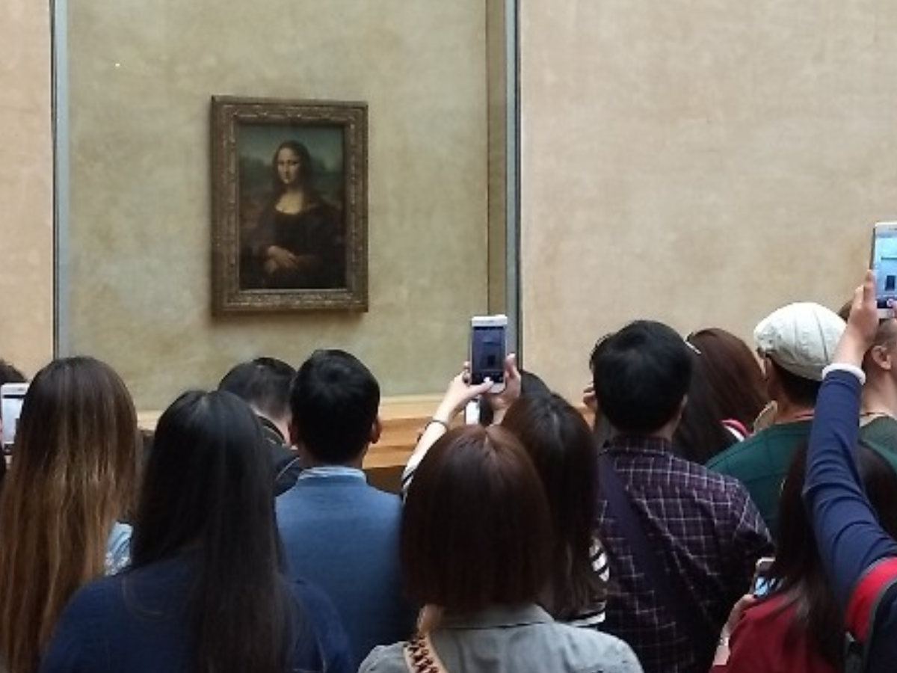
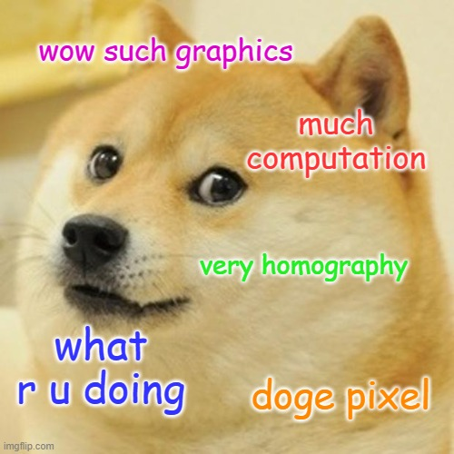
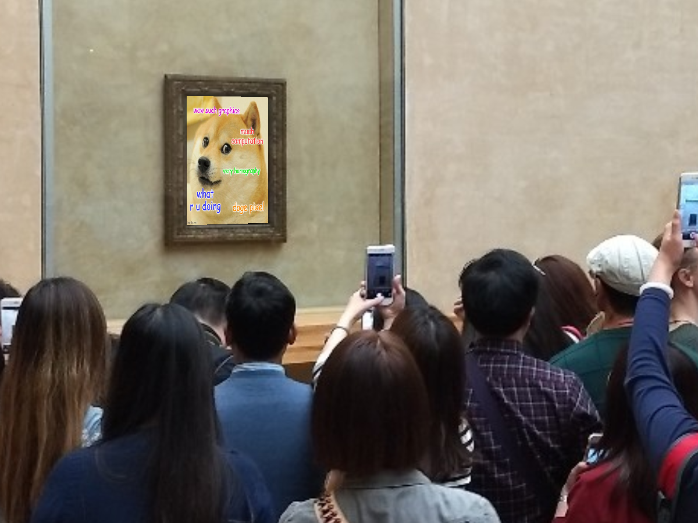

# Homography transformation for warping images

This work is an assignment from Computer Graphics course at [Instituto Militar de Engenharia](https://en.wikipedia.org/wiki/Instituto_Militar_de_Engenharia). It should wrap an image over another like a decal as seen bellow.

## Example

<table border=0>
<tr>
    <td>
         
    </td>
    <td>
         
    </td>
    <td>
          
    </td>
</tr>
<tr>
    <td colspan="3" align="center">
        
    </td>
</tr>
</table>
