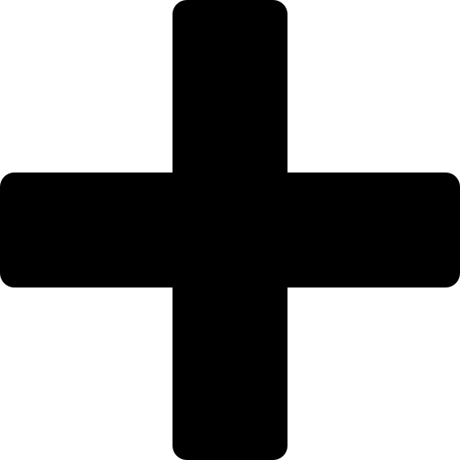

# Homography transformation for warping images

This work is an assignment from the Computer Graphics course at [Instituto Militar de Engenharia](https://en.wikipedia.org/wiki/Instituto_Militar_de_Engenharia). It should wrap an image over another like a decal as seen below.

## Example

Decal Mona Lisa with a Doge decal

<table style="width: 100%" border=0>
<tr>
    <td>
         
    </td>
    <td>
         
    </td>
    <td>
          
    </td>
</tr>
<tr>
    <td colspan="3" align="center">
        
    </td>
</tr>
</table>

## Instructions

Some instructions on how to configure and run the script.

### Configuration

Inside `config.py` create a new configuration dict. Choose a base image and a decal image and place them inside the `images/` folder. And then set some variables.

- DECAL: this will be the name of the decal
- PICTURE: this will be the name of the base image
- NAME: the filename for the result (should be .png)
- PICTURE_BORDER: a list of the 4 points of the pixels that describe the border on which the decal needs to be applied

Then, inside main.py, import your config and pass it to the function `build_image(your_config)`.

### Running

1. There is the option to open the project inside VSCode using the dev container. Otherwise run:

```
pip install -r requirements.txt
```

2. Run

```
python3 main.py
```
